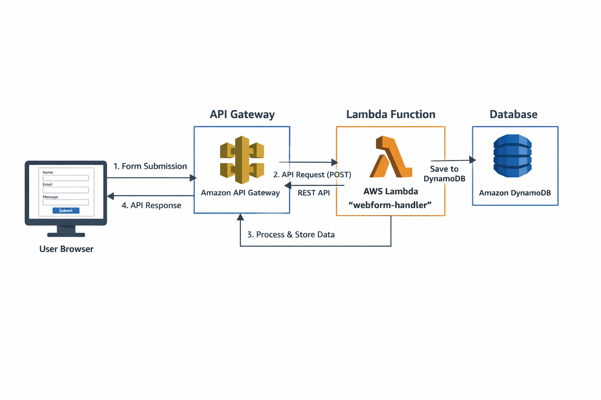
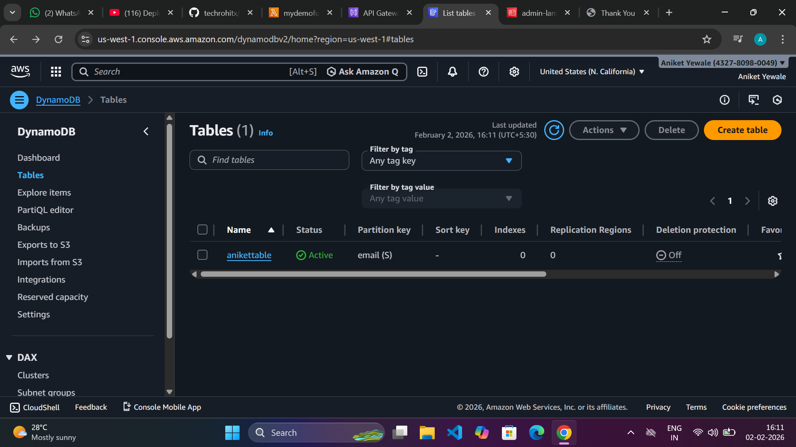
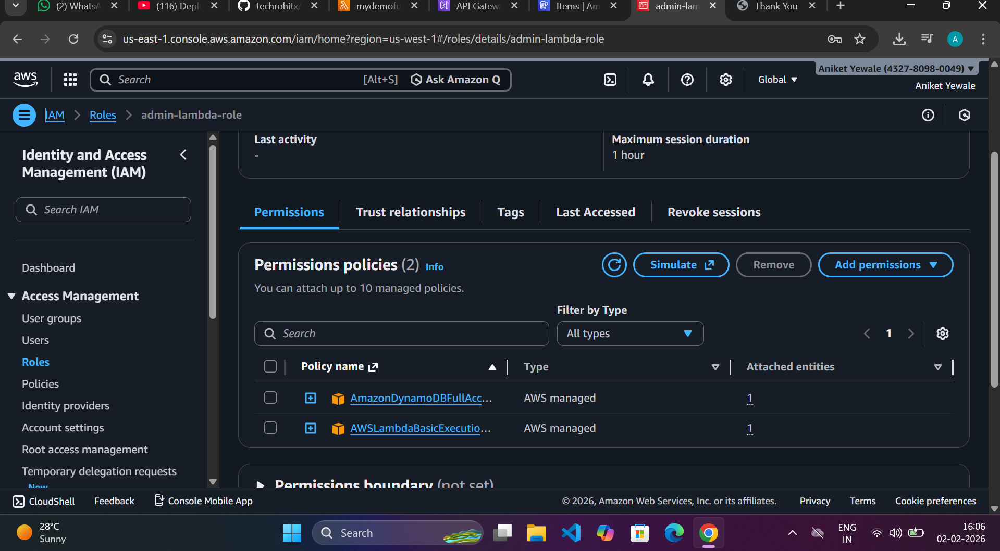
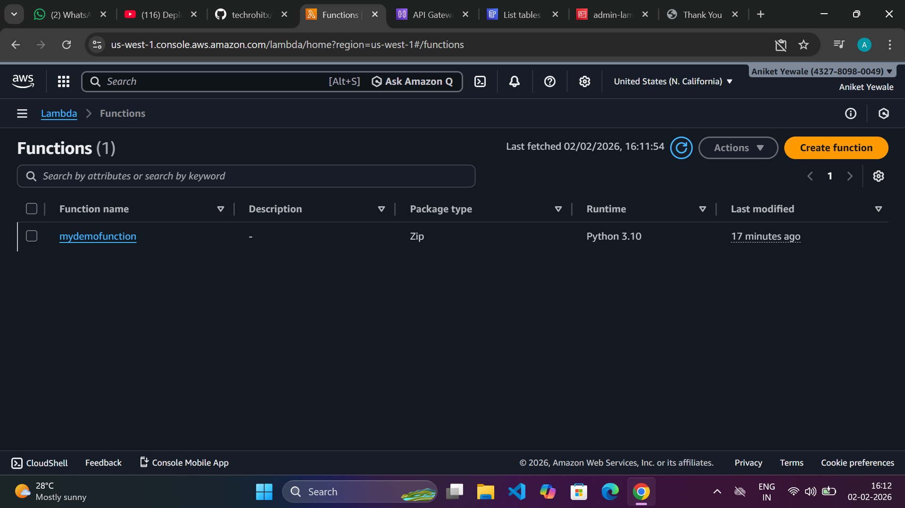
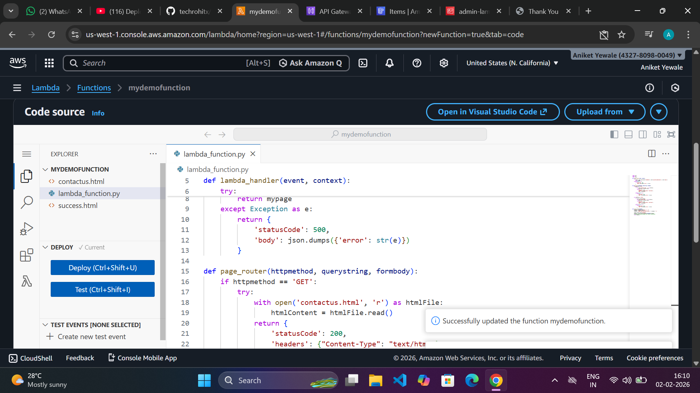
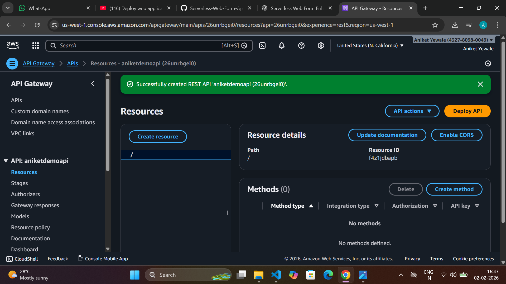
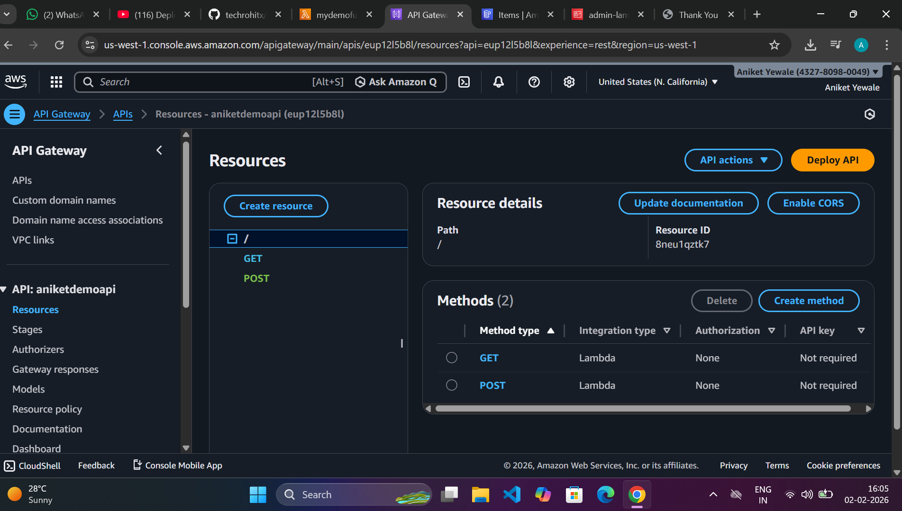
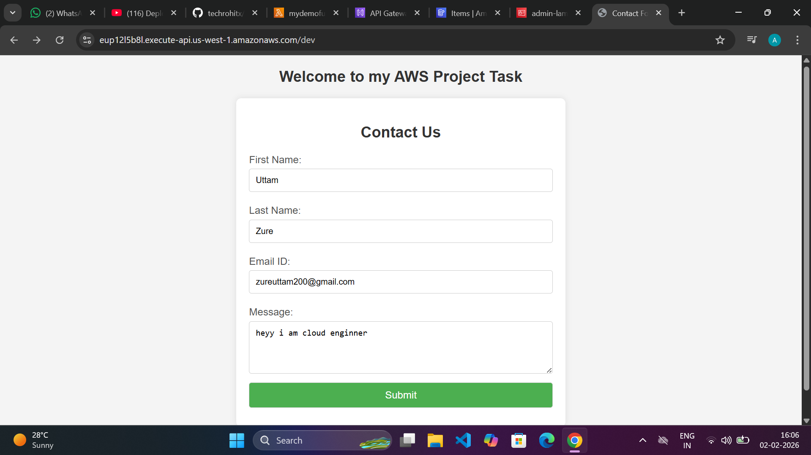
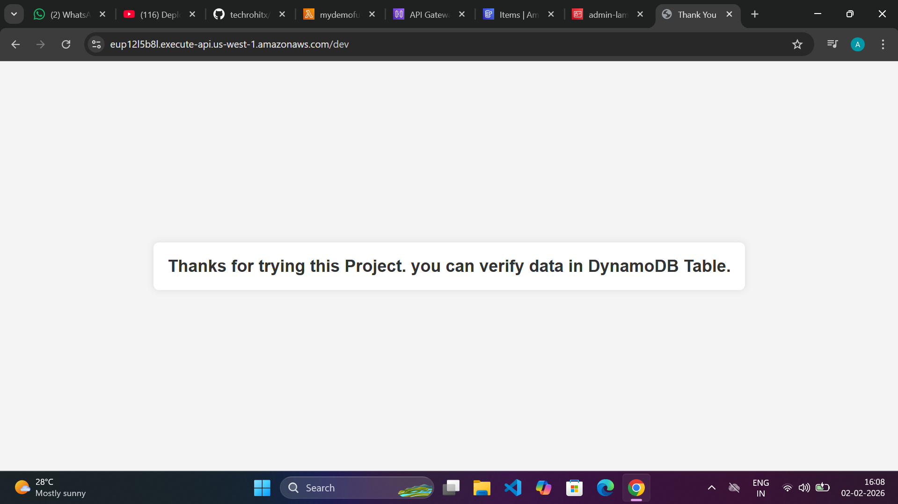
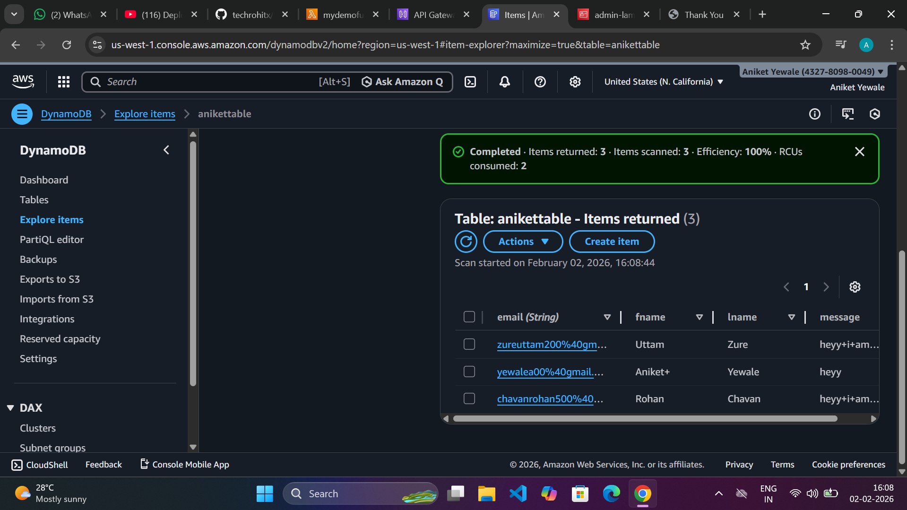

# 📌 **Serverless Web Form Application:-**

### This project demonstrates how to deploy a **serverless web form application** using **AWS Lambda, API Gateway, and DynamoDB**. The form collects user data and stores it securely in DynamoDB without managing any servers.

---

## **🧰 Tech Stack**

* **Frontend**: HTML, CSS, JavaScript
* **Backend**: AWS Lambda (Python)
* **Database**: Amazon DynamoDB
* **API**: Amazon API Gateway (REST API)
* **Security**: IAM Role

---

## 🗂️ **Project Architecture:-**



---

## 🧩 **Step 1: Create DynamoDB Table**

### 1. Go to **AWS Console → DynamoDB → Create table**

### 2. Table name: `anikettable`

### 3. Partition key: `email` (String)

### 4. Click **Create table:-**

---


---

## 🧩 **Step 2: Create IAM Role for Lambda**

### *1. Go to* **IAM → Roles → Create role**

### *2. Select* **AWS service → Lambda**

### *3. Attach policies:-*

   * `AmazonDynamoDBFullAccess`
   * `AWSLambdaBasicExecutionRole`


### **4. Role name:-** `admin-lambda-role`
---



---

## 🧩 **Step 3: Create Lambda Function**

### 1. Go to **AWS Console → Lambda → Create function**

### 2. Function name: ```webdemofunction```

### 3. Runtime: **Python 3.10**
---

---

### 4. Execution role: **Use existing role**

### 5. Select role: `admin-lambda-role`
---


## 🧑‍💻 **Lambda Function zip file uploading :-**



Click **Deploy**.

---

## 🧩 **Step 4: Create API Gateway :-**

### 1. Go to **API Gateway → Create API**

### 2. Choose **REST API**

### 3. API name: `aniketdemoapi`


---


---


### 4. Create methods **GET** and **POST**

### 5. Integration type: **Lambda Function**

### 6. Select region and function `webform-handler`



---

## 🚀 **Deploy API :-**

### 1. Click **Actions → Deploy API**
### 2. Stage name: `dev`
### 3. Copy **Invoke URL**


### **Invoke URL**:-

```
https://cemj793d8l.execute-api.us-east-1.amazonaws.com/dev
```

---


## 🧪 **Testing / Output:-**

###  **1. Paste Invoke URL in Broweser**



### **2. Fill form and submit**


### **3. Go to DynamoDB → Explore items**

### **4. Data should be stored successfully**



---

## 📌 **Key Benefits**

* No server management
* Scalable & cost-effective
* Secure using IAM


---

## 🏁 **Conclusion**

 ### This project is ideal for **Cloud / DevOps freshers** to understand **serverless architecture** using AWS core services.
 ---

## :red_circle: **Summary** 

Serverless Web Form Application (AWS)
Built a serverless form submission system using AWS Lambda, API Gateway, and DynamoDB. Implemented REST APIs, backend processing in Python, IAM-based security, and stored user data in DynamoDB with high scalability and zero server management.
